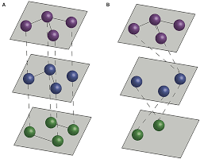

# What Is Project3?
Project3 is a tool for anaylizing and visualizing networks, with a particular focus on multilayer networks and streaming data. In this article, we will define some key terms, list some potential use cases, and provide resources to get you ready for your Project3 journey.

## Networks
Networks are critical and prevalent in our everyday lives: communication networks allow us to seamlessly communicate with people from all across the world, transportation networks allow you to travel from point A to B, social networks allow us to meet and connect with new people online.

As mentioned above, the primary purpose of Project3 is to assist you in visualizing and anaylzing networks. Network anaylsis can help us find new insights and efficencies.

For the sake of this introduction, there are two aspects of networks you'll need to be familiar with for this article: Edges and Nodes. An Edge represents a connection, while a Node represents a connection point. For example, in a social network the Nodes could represent people while Edges could represent the connections between those people. In the example below, a bus network a Node could represent bus stops while Edges would represent the routes between them.

The above example shows the London Underground as a network, where the Nodes represent stops and Edges represent the connections between stops.

To connect your networks to Project3, you can upload your networks directly in the application or connect to a Neo4j database.

In Project3, networks are visualized as a collection of Edges and Nodes. Edges and Nodes can have several different features as well, such as direction, weights, labels, etc. We highly recommend refering to our [All About Networks article here](userDocs/conceptual/networks/AllAboutNetworks.md) for more information about different network characteristic you can represent in Project3.

## Network Analysis
One of the most prominent features in Project3 is the ability to easily anaylize networks. Network anaylsis can be useful for a variety of applications. For example an anaylsis of transportation networks can allow us to find the fastest path between point A and point B.

Project3 supports Neo4j's Cypher querying language for network anaylsis, but also provides easy to use tools for those with little to no experience with Cypher to anaylize their networks as well. If you're interested in learning more about network anaylsis in Project3, we recommend refering to our [Network Anaylsis article here](userDocs/conceptual/networks/NetworkAnaylsis.md).

## What Are Multilayer Networks?
Multilayer networks are similar to the aforementioned networks, but with one big difference: a Node can be a part of multiple networks.

Take for example a public transportation network. A city may have many methods for public transportation, such as buses, lightrails, and ferries. Each of these could be represented by their own network, where Nodes are stops and Edges are the routes between stops.

However, some stops may have mutliple modes of transportations that use it. For example, a Node representing a train station could be part of both a bus network if a bus stops there and a train network. Each network could be thought of a "layer" in the graph, and each Node that the bus and train networks share a connection point.

Since multilayer networks can be infinately deep, it makes both the anaylsis and visualization of them somehwat challenging. Project3 however streamlines the process, and allows you to intuitively anaylize and visualize them.

If you're interested in learning more about multilayer networks, we recommend refering to our [What Are Multilayer Networks article here](userDocs/conceptual/networks/WhatAreMultilayerNetworks.md).

## What Is Data Streaming?
Sometimes, data can change over time. Project3 supports real time data streaming, meaning that as the data changes, so too does Project3's anaylsis and visualization. If you're interested in learning more about data streaming, we recommend refering to our [What Is Data Streaming article here](userDocs/conceptual/streaming/WhatIsDataStreaming.md).

## Review
To review, Project3 is a network anaylsis and visualization tool with several useful features, including:
* The ability to visualize different types of networks.
* The ability to anaylize Neo4j databases along with directly uploaded data.
* The ability for both technically experienced and inexperienced users to anaylize networks.
* Support for multilayer network visualization and anaylsis.
* Support for real time data streaming.

## Ready To Get Started?
Now that you have a solid grasp on Project3, we hope you are ready to get started! You can download Project3 from [the Github repo](https://github.com/ameyabp/multilayer-networks-analysis). Please note you will need both a Neo4j database to connect to in order to currently utilize the tool. To get started, check out this article on [visualizing your first dataset with Project3](userDocs/tutorials/YourFirstDataset.md).

If you're wanting to use Project3 to visualize and anaylize your networks, we recommend referencing [the Project3 user docs here](userDocs/home.md), where you can find conceptual articles, tutorials, FAQs, and more relating to Project3.

## Interested In Contributing?
Are you interested in contributing to Project3? Feel free to check out [our developer docs here](developerDocs/home.md).