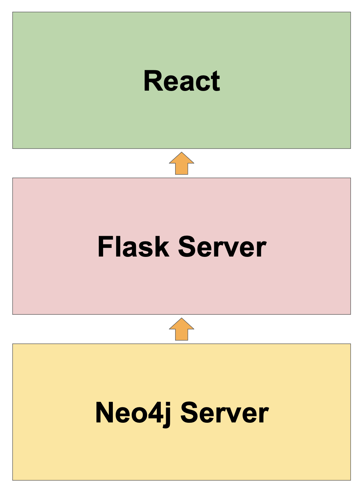

# Project3's Tech Stack

In this article, we will discuss Project3's tech stack.

## Tech Stack

Project3 has a relatively simple tech stack, shown above. 

### Frontend: React & Deck.gl
The frontend is in React, which renders the retrieved data using [Deck.gl](https://deck.gl), an open source graph visualization library. Outside of this, React handles none of the querying nor layouts, rather this is preformed with Flask & Neo4j.

React must never connect directly to Neo4j; rather, all calls to the Neo4j database must be passed through the Flask server to ensure consistency.

### Flask
The Flask sever serves two primary functions: for one, it passes all data between the Neo4j database and the frontend. In addition, it generates layouts for data that may not have geocoordinates.

### Neo4j
Neo4j is a graph database program that serves as the main source of Project3's Network storage and anaylsis. This is where all network data should be stored.