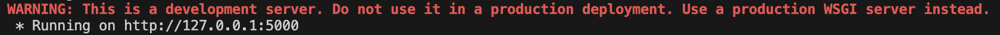

# Working With igraph and Flask Project3

In this article, we will cover how to work with both igraph and Flask in Project3.

## igraph and Flask

igraph and Flask are two powerful Python libraries that Project3 heavily relies on, so having a good grasp on each is critical to ensuring that you have a solid understanding of how Project3 works.

### igraph
igraph is the primary library used for generating layouts for data without any coordinates.

### Flask
Flask is a Python-based server which allows us to easily develop our Project3 API. Project3's frontend will call it to get all of it's data from Neo4j and to get the layout from igraph.

## Dependencies

Before working with igraph & Flask, ensure you have the following dependencies installed in your Python environment:
- [igraph, a networks library for Python documentation](https://igraph.org/python/tutorial/0.9.8/install.html) for installation details.
- [NetworkX, a networks library for Python documentation](https://networkx.org/documentation/stable/install.html) for installation details.
- [Neo4j Python Driver documentation](https://neo4j.com/docs/api/python-driver/current/) for installation details.
- [Flask Driver documentation](https://flask.palletsprojects.com/en/stable/installation/) for installation details.

## Setting Up

First, we need to set the Neo4j URI and Password in `flask/app.py` to the correct value for our Neo4j instance. Refer to our [Working With Neo4j article here](workingWithNeo4j.md) for more information and instructions.

Next we need to get the correct Flask URI so our React frontend can connect to our Flask backend:
1. From the root folder of Project3, run the command `python flask/app.py` from the terminal to start the Flask server.
    
    - This will print the Flask URI for your local machine (usually formatted as `"http://127.0.0.1:5000"`).
2. Copy this value for later use.

After getting the correct Flask URI, set it to the correct value in the frontend:
1. From the root folder of Project3, navigate to `frontend/src/App.js`.
2. Navigate to the global variable labeled `FLASK_URI`.
3. Paste the value for the correct URI as the value for `FLASK_URI`.

## Project3 API

For more information on the Project3 API, refer to our [API documentation here](../../api/flaskAPI.md).

## Further Reading

Now that we have all dependencies installed and our Flask server is up and running, we can finally work with Flask and igraph! Refer to the following articles to get a better idea for how each work:
- [Getting Started With igraph](https://igraph.org/python/tutorial/0.9.8/tutorial.html).
- [Getting Started With Flask](https://www.geeksforgeeks.org/flask-tutorial/).
