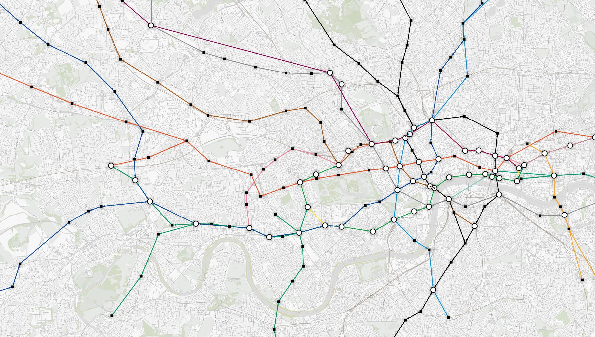

# All About Networks
In this article, we go in depth on what a network is, different charateristics, and the different features that Project3 can you visualize pertaining to them.

## What is a Network?
Networks are critical and prevalent in our everyday lives: communication networks allow us to seamlessly communicate with people from all across the world, transportation networks allow you to travel from point A to B, social networks allow us to meet and connect with new people online.

Networks have two main components: Edges and Nodes.

### Edges
Edges represent connections. Think of a road in a highway network or a relationship between people in a social network.

### Nodes
Nodes represent a connection point. Think a junction in a highway network or a person in a social network.

Take for example the above image of the London Underground. In it, stops are represented by nodes, while routes between them are represented by edges.

## Node Characteristics
In Project3, Nodes can have several characteristics, including:
* Labels: Nodes can have different labels. For example, in a social network a Node representing a person can have a label representing their age.

## Edge Characteristics
In Project3, Edges can have several characteristics as well, including:
* Weight/Cost: Edges can be set to have different weights and costs. Think different lengths of roads in a transportation network.
* Direction: Sometimes, a connection between Nodes can only be one way (think a one way street). Edges can be set to represent this in Project3 as well.