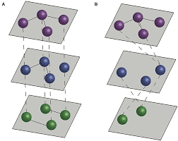

# What Are Multilayer Networks?
In this article, we will discuss what multilayer networks are, along with comparing and contrasting them to classic, single layer networks.

## Network Layers
A multilayer network in it's simpliest form is a collection of independent networks, where a Node can be a part of multiple networks. For example, a Node in network A could also be present in network B. In this way, each network act as a "layer" of the larger mutlilayer network.

The image above shows two example of multilayer networks. See how the connections between the Nodes represent somewhat of a bridge between the different network layers?

Take for example a public transportation network. A city may have many methods for public transportation, such as buses, subways, and ferries. Each of these could be represented by their own network, where Nodes are stops and Edges are the routes between stops.
