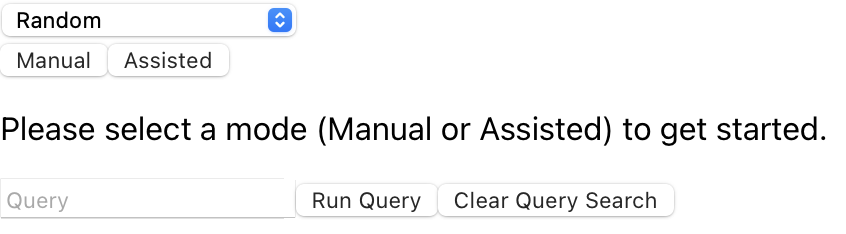

# Geocoordinate Data In Project3

In this article, we will discuss how to add data with geocoordinates to Project3.

## Geocoordinate Info

In order to properly add geocoordinate info, you will need to ensure the following:
1. The coordinate fields in the Neo4j database instance are titled "Lat" and "Long"
2. The coordinate fields in the Neo4j database instance are titled "Lat2" and "Long2" for connecting nodes for proper edge rendering

## Render Geocoordinates

To use the geocoordinates when visualizing data, use the following workflow:

1. Click the Layout Selector to reveal the current list of available layout options
2. From the dropdown, select "Default"
    - A message labeled "Rendering with new layout..." appears while data populates
    - After a moment, the data with the geocoordinate based layout will be rendered on screen

Please note rendering times may very depending on the size of the dataset.