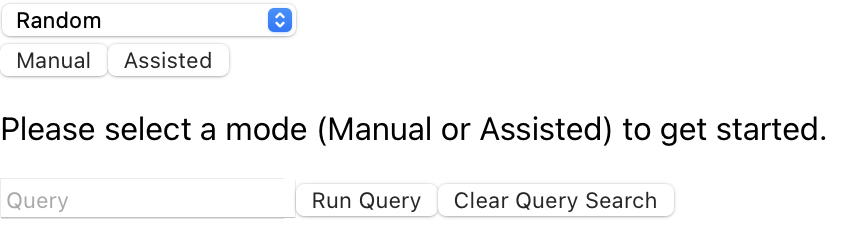

# Cypher Querying

In this article, we will cover how to query your Neo4j data using Cypher in Project3, both manually and with Assisted Mode.

## Manual Cypher Querying

To manually query your Neo4j data directly in Project3 using Cypher, you can do so via the following workflow:

1. Navigate to the upper right corner of the screen.
2. Type your query in the bar labeled "Query".
4. To clear your query search, click the "Clear Query Search" button.
3. To run and visualize your query, click the "Run Query" button and wait a moment for results to populate.

## Cypher Querying With Assisted Mode

You can also use Project3's assisted Cypher querying to quickly and easily compose Cypher queries by enabling Assisted Mode. To enable assisted mode:
1. Navigate to the upper right corner of the screen.
2. Click the "Assisted" button.

From here, you will be presented with several options for composing a query:

- The first four buttons will append that particular string to the end of your Cypher query (i.e. "WHERE clause" + "MATCH (n)" -> "WHERE clause MATCH (n)").
- The "GET EVERYTHING" button will return and visualize all data in the database instance.
- The "Subset Size" button will return a subset of the dataset. Note that this setting will be applied to all queries as well.