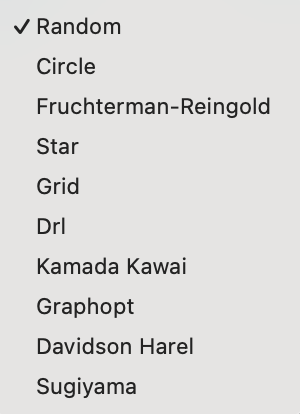

# How To Switch Layout Of Network Data

In this article, we will discuss how to switch the coordinate layout for network data in Project3.

## Layout Selector

In order to change the layout of your data in Project3, utilize the Layout Selector, which is in the upper right hand corner of the screen:

From here, use the following workflow for changing the coordinate layout of data in Project3:

1. Click the Layout Selector to reveal the current list of available layout options.
2. From the dropdown, click your desired layout option.
3. A message labeled "Rendering with new layout..." will appear while data populates.
4. After a moment, the data with the new layout will be rendered on screen.

## Types Of Layouts & Geocoordinate Data

Project3 has the following layout types:
- Default (the default geocoordinates of the data).
- Random
- Circle
- Fruchterman-Riengold
- Star
- Grid
- Drl
- Kamada Kawaii
- Graphopt
- Davidson Harel
- Sugiyama

The option for the "Default" layout will only be present if you're using geocoordinated data. For more information on adding data with geocoordinates to Project3, refer to [this Project3 article on using Geocoordinates](CoordinatesGeodata.md).
