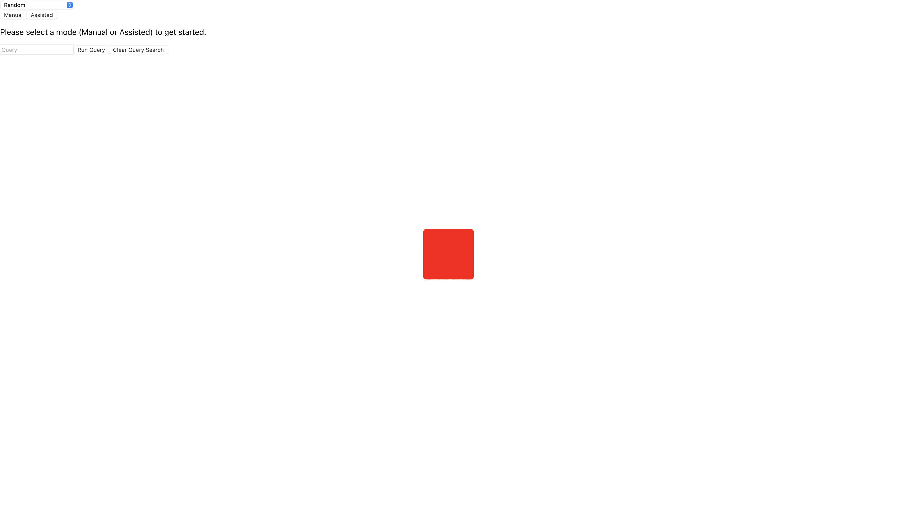
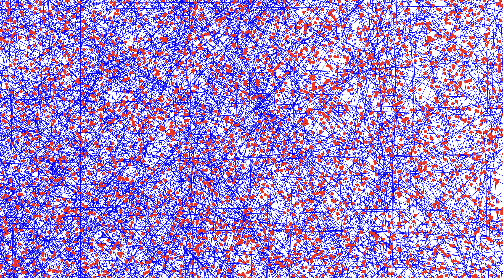
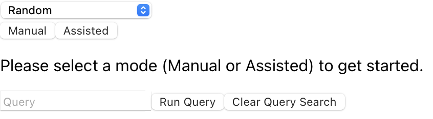
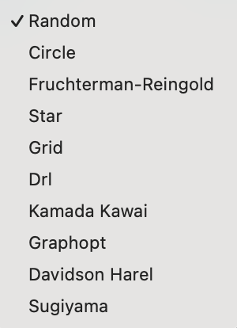
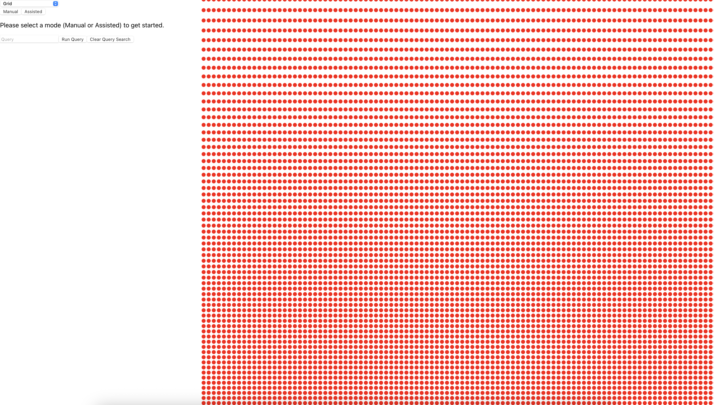

# Visualizing Your First Dataset With Project3

In this tutorial, we will walk you though how to visualize your first dataset, a simple but relatively large network based after the novel Frankenstein, using Project3.

## Set-Up

Project3 is current in it's alpha development phase. As such, please reference our [developer documentation "How To Start The Project3 Development Enviroment" article here](../../developerDocs/task/basics/developmentEnv.md) to set up the Project3 enviroment on your local machine.

## What You Will Need

In order to visualize your first dataset, you will need the following:
- The Project3 Developer Enviroment set-up.
- An empty Neo4j database instance.

## Setting Up Neo4j Instance

Now that we have the enviroment set-up, we can finally begin visualizing our dataset! We will be using a network dataset based after the novel Frankenstein. It's a relatively simple network (undirected and unweighted), however as you will find it is significantly large, containing over 73,000 nodes!

Before we can visualize our dataset, we need to add the data to our empty Neo4j database instance. We recommend the following workflow.
1. In the root folder for Project3, run the command `python flask/demo_files/frankenstein_demo/setup_demo.py`.
2. Wait for the run to exit: this may take a while.
    - Feel free to exit the run early, please note that this will result in only a subset of the data being present in the database however.

## Visualization

Now that we have our demo set-up, we can finally visualize the dataset and get an idea of what Project3 is capable of!

First, you will need to start the Project3 developer enviroment via the following workflow:
1. Ensure your Neo4j instance is running.
2. From the root folder, run the command `python flask/app.py`. This will start the Flask development enviroment.
3. Open a seperate terminal, and from the root folder run `cd frontend` to navigate into the `frontend` directory.
4. Run `npm run start` to start the frontend.

Alternatively on Mac & Linux, in the root folder for Project3 run the command `./start.sh`. This shell script will start the developer enviroment for you. Please note that your Neo4j database instance will have to be active before running this script in order for it to work properly.

Now, you can view the program by navigating to `https://localhost:3000/` in your web browser. NOTE: Check the the terminal after running `npm run start` to ensure that it lists `https://localhost:3000/`. On some devices, the development enviroment may run on `https://localhost:3001/` due to default port configurations.

## Entering Project3

When you start Project3, you should be met with the following:

Zoom in using the `+` and `-` keys on your keyboard, or your trackpad if you have on. From here, you'll be able to see that you're actually looking at a network composed of thousands of nodes:

## Changing Layouts

Now that we know our dataset's rendering properly, let's try changing the layout to see what happens. Navigate to the Layout Selector labeled "Random" in the upper left hand corner of the screen:

From here, we can change the layout:

1. Click the Layout Selector to reveal the current list of avalible layout options.
2. From the dropdown, click your desired layout option (we'll chose "Grid" for this example).
3. A message labeled "Rendering with new layout..." will appear while data populates.
4. After a moment, the data with new layout will be rendered on screen.

## Further Reading

Now that you've explored how to visualize a dataset with Project3, it's time to learn more about the different analysis options you have! We recommend refering to our [Cypher Querying article here](../howto/querying/CypherQuerying.md) to learn more about how to query your data with Cypher in Project3.